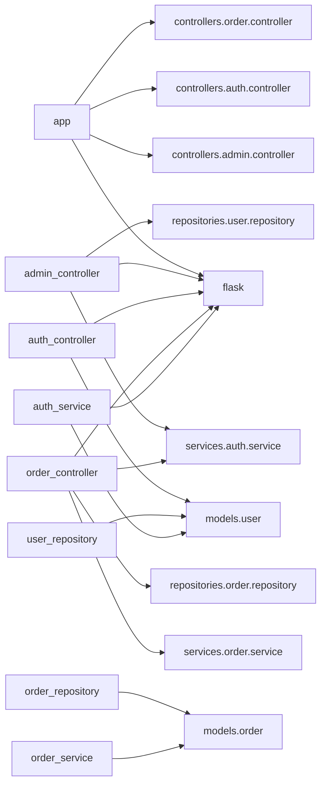
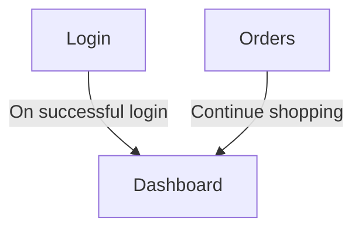

# sample-app — Reverse Engineering Report

> **Auto-generated** by the Reverse Engineer Skill · 2026-07-24 05:40 UTC
> Source: `marketplace/SampleOutputs/sample-app-source` (local project)
> Primary Language: **Python**  |  Project Type: **API-Driven Web Application (MVC)**
> Analysis Engine: **Pure static heuristics — no API keys required**

---

## Table of Contents

1. [System Design Overview](#1-system-design-overview)
2. [Authentication & Access Control](#2-authentication--access-control)
3. [Business Logic Extractor](#3-business-logic-extractor)
4. [Screen-by-Screen Navigation](#4-screen-by-screen-navigation)

---

## 1. System Design Overview

> Complete architectural picture of `sample-app` — how the system is built,
> what it uses, and how its parts connect.

### 1.1 Executive Summary

sample-app is a Python application in the E-Commerce / Online Retail domain. The codebase contains 11 source files, 7 classes, and 35 methods following a MVC Monolith architecture.

| Attribute | Value |
|-----------|-------|
| **Architecture Pattern** | MVC Monolith |
| **Modernization Priority** | LOW |
| **Platform** | Python / Linux |
| **Project Type** | API-Driven Web Application (MVC) |
| **Primary Language** | Python |
| **Tech Stack** | `Flask` |

**Priority Reasoning:** The repository has 11 source files — a manageable scope for incremental improvement without a full rewrite.

---

### 1.2 Codebase Metrics

| Language | Files | Share |
|----------|-------|-------|
| Python | 11 | 100% |

| Metric | Value |
|--------|-------|
| Total Source Files | **11** |
| Classes Defined | **7** |
| Methods & Functions | **35** |
| API Endpoints Extracted | **9** |
| Database Entities | **0** |
| External Dependencies | **11** |
| Unreferenced Files | **1** |

---

### 1.3 Architecture Layers

- API / Presentation Layer
- Business Logic Layer
- Data Access Layer

### System Block Diagram

```text
┌──────────────────────────────────────────────────────────────────────┐
│                            USER / CLIENT                             │
├──────────────────────────────────────────────────────────────────────┤
│  • Web Browser / API Client                                          │
└──────────────────────────────────────────────────────────────────────┘
 
                                   │ (HTTP)
                                   ▼
 
┌──────────────────────────────────────────────────────────────────────┐
│                       API / PRESENTATION LAYER                       │
├──────────────────────────────────────────────────────────────────────┤
│  • admin_controller                 • auth_controller                  │
│  • order_controller                                                  │
└──────────────────────────────────────────────────────────────────────┘
 
                                   │ (calls)
                                   ▼
 
┌──────────────────────────────────────────────────────────────────────┐
│                    BUSINESS LOGIC / SERVICE LAYER                    │
├──────────────────────────────────────────────────────────────────────┤
│  • auth_service                     • OrderService                     │
└──────────────────────────────────────────────────────────────────────┘
 
                                   │ (data ops)
                                   ▼
 
┌──────────────────────────────────────────────────────────────────────┐
│                    DATA ACCESS / REPOSITORY LAYER                    │
├──────────────────────────────────────────────────────────────────────┤
│  • OrderRepository                  • UserRepository                   │
└──────────────────────────────────────────────────────────────────────┘
```

### Module Dependency Graph (Code Dependency)



<details>
<summary><b>Show Dependency Edge List (Plain-Text View)</b></summary>

- `app` → `controllers.admin.controller`
- `app` → `controllers.auth.controller`
- `app` → `flask`
- `app` → `controllers.order.controller`
- `admin_controller` → `flask`
- `admin_controller` → `services.auth.service`
- `admin_controller` → `repositories.user.repository`
- `auth_controller` → `flask`
- `auth_controller` → `models.user`
- `order_controller` → `services.order.service`
- `order_controller` → `flask`
- `order_controller` → `services.auth.service`
- `order_controller` → `repositories.order.repository`
- `order_repository` → `models.order`
- `user_repository` → `models.user`
- `auth_service` → `models.user`
- `auth_service` → `flask`
- `order_service` → `models.order`
</details>

---

### 1.4 API Surface

**Total Endpoints:** 9

| Method | Path | Handler | File |
|--------|------|---------|------|
| `GET` | `/` | `global.view_func()` | `app.py` |
| `GET` | `/admin/users` | `global.view_func()` | `admin_controller.py` |
| `GET` | `/admin/reports` | `global.view_func()` | `admin_controller.py` |
| `GET, POST` | `/login` | `global.view_func()` | `auth_controller.py` |
| `POST` | `/logout` | `global.view_func()` | `auth_controller.py` |
| `GET` | `/dashboard` | `global.view_func()` | `order_controller.py` |
| `GET, POST` | `/api/orders` | `global.view_func()` | `order_controller.py` |
| `GET` | `/api/orders/<int:order_id>` | `global.view_func()` | `order_controller.py` |
| `POST` | `/api/orders/<int:order_id>/cancel` | `global.view_func()` | `order_controller.py` |

---

### 1.5 Data Architecture

**Schema Summary**

| Metric | Value |
|--------|-------|
| Entities Detected | **0** |
| Relationships | **0** |
| Bounded Contexts | **4** |

_No entity definitions detected._

**Proposed Microservice Boundaries (Database-Per-Service)**

#### User & Identity Service
- Entities: _From AI roadmap_

#### Product & Catalog Service
- Entities: _From AI roadmap_

#### Order & Payment Service
- Entities: _From AI roadmap_

#### Core Domain Service
- Entities: _From AI roadmap_


---

### 1.6 Top Connected Modules

| Module | Outgoing References |
|--------|-------------------|
| `app` | 4 |
| `order_controller` | 4 |
| `admin_controller` | 3 |
| `auth_service` | 3 |
| `auth_controller` | 2 |
| `order_repository` | 1 |
| `user_repository` | 1 |
| `order_service` | 1 |
| `order` | 0 |
| `product` | 0 |

---

### 1.7 Modernization Roadmap

**Target Stack:** `FastAPI`, `Python 3.12`, `SQLAlchemy 2.0`, `Docker`, `Redis`


**Phase 1: Assessment & Quick Wins** `LOW risk` — _1 month_
  - Code review
  - Identify easy refactors
  - Set up linting and CI

**Phase 2: Incremental Modernization** `MEDIUM risk` — _2-4 months_
  - Upgrade dependencies
  - Add test coverage
  - Refactor hotspots

**Phase 3: Cloud & Container Readiness** `LOW risk` — _1-2 months_
  - Dockerize application
  - Add health checks
  - Set up monitoring

**Phase 4: Final Validation** `LOW risk` — _1 month_
  - Full regression tests
  - Performance validation
  - Go-live


**Proposed Microservices:** - **User & Identity Service**
- **Product & Catalog Service**
- **Order & Payment Service**
- **Core Domain Service**

**Risk Factors:**
- Team retraining required for new framework/toolchain

**Estimated Effort:** 4-8 months

---

### 1.8 Tech Debt Highlights

- Moderate dependency footprint (11 packages) — review for outdated versions

| Area | Severity | Details |
|------|----------|---------|
| Legacy Dependencies | HIGH | 11 external deps — audit for CVEs |
| Dead Code | LOW | 1 unreferenced files |
| API Coverage | LOW | 9 endpoints documented |

---

## 2. Authentication & Access Control

> Detected authorization models: **Hybrid RBAC + ReBAC**

### 2.1 Auth Summary

| Attribute | Value |
|-----------|-------|
| **Dominant Auth Model** | Hybrid RBAC + ReBAC |
| **Auth Frameworks** | None detected |
| **Named Roles** | `admin`, `customer` |
| **Named Policies** | _None detected_ |
| **Protected Routes** | 6 |
| **Unguarded Routes** | 3 |

### 2.2 Detected Auth Frameworks

- _None detected_

---

### 2.3 RBAC — Role-Based Access Control

> Grants permissions based on named **roles** assigned to users.
> Example: `[Authorize(Roles="Admin")]`, `@PreAuthorize("hasRole('MANAGER')")`.

| File | Pattern | Example |
|------|---------|----------|
| `admin_controller.py` | Django/Flask @login_required | @login_required |
| `admin_controller.py` | Python role_required | admin |
| `order_controller.py` | Django/Flask @login_required | @login_required |

---

### 2.4 ABAC — Attribute/Policy-Based Access Control

> Grants permissions based on **attributes** (claims, policies, context).
> Example: `[Authorize(Policy="CanEditOrder")]`, `IAuthorizationRequirement`.

_No ABAC patterns detected._

---

### 2.5 ReBAC — Relationship-Based Access Control

> Grants permissions based on **relationships** between users and resources.
> Example: `IsOwner()`, `CreatedBy == currentUser`, Zanzibar-style tuples.

| File | Pattern | Example |
|------|---------|----------|
| `order_controller.py` | canEdit() relationship check |  |
| `auth_service.py` | canEdit() relationship check |  |

---

### 2.6 Route Protection Map

**Protected Routes (auth guard present):**

- `/admin/users`
- `/admin/reports`
- `/dashboard`
- `/api/orders`
- `/api/orders/<int:order_id>`
- `/api/orders/<int:order_id>/cancel`

**Public / Unguarded Routes:**

- `/`
- `/login`
- `/logout`

> ⚠️ Unguarded routes should be reviewed — some may be intentionally public
> (health checks, login endpoint) while others may require access control.

---

## 3. Business Logic Extractor

> Domain workflows, business rules, and entity glossary extracted from
> API endpoints, class names, and ORM entity model.

### 3.1 Business Domain

**Domain:** E-Commerce / Online Retail

### What the System Does

sample-app is a Python application operating in the **E-Commerce / Online Retail** domain. It serves 2 identified user role(s) — User, Admin — through 9 API endpoint(s) backed by 0 data entity/entities.

The system manages core business data across 0 entities and exposes its functionality via a structured API. Key integrations detected include: Standard HTTP API, Relational Database.

This analysis was produced entirely from static code analysis — no AI API calls are made. For AI-powered narrative, open the generated report in Claude Code or GitHub Copilot and ask it to enhance the executive summary and business logic sections.

---

### 3.2 Core Business Workflows (End-to-End)


#### General Management
Handles general-related operations (GET).

**Steps:**
  1. Client sends request to /
  2. System validates input and applies business rules
  3. Response returned with updated state

**Key endpoints:** `/`

#### Admin Management
Handles admin-related operations (GET).

**Steps:**
  1. Client sends request to /admin/users
  2. System validates input and applies business rules
  3. Response returned with updated state

**Key endpoints:** `/admin/users`, `/admin/reports`

#### Login Management
Handles login-related operations (GET, POST).

**Steps:**
  1. Client sends request to /login
  2. System validates input and applies business rules
  3. Response returned with updated state

**Key endpoints:** `/login`

#### Logout Management
Handles logout-related operations (POST).

**Steps:**
  1. Client sends request to /logout
  2. System validates input and applies business rules
  3. Response returned with updated state

**Key endpoints:** `/logout`

#### Dashboard Management
Handles dashboard-related operations (GET).

**Steps:**
  1. Client sends request to /dashboard
  2. System validates input and applies business rules
  3. Response returned with updated state

**Key endpoints:** `/dashboard`


---

### 3.3 User Roles & Actors

- **User**
- **Admin**

---

### 3.4 Key Business Rules

- The system exposes 9 API endpoints enforcing structured data access.

---

### 3.5 Domain Entity Glossary

_No entity definitions detected in analyzed files._

---

### 3.6 External Integrations

- `Standard HTTP API`
- `Relational Database`

---

### 3.7 Codebase → Report Mapping

| Report Section | Key Files in Codebase |
|----------------|-----------------------|
| API / Endpoints | `app.py`, `admin_controller.py`, `admin_controller.py`, `auth_controller.py`, `auth_controller.py` |
| Business Logic | _Inferred from services_ |
| Data Entities | _N/A_ |

---

## 4. Screen-by-Screen Navigation

> End-to-end user journey through `sample-app` — every screen/page detected,
> what it does, and how users move between them.

**Project Type:** API-Driven Web Application (MVC)
**Screens Detected:** 5

---

### 4.1 Navigation Flow Diagram



---

### 4.2 Navigation Flow (Text)

- **Login** → **Dashboard** _On successful login_
- **Orders** → **Dashboard** _Continue shopping_


---

### 4.3 Screen Inventory (Screen-by-Screen)


#### Admin
- **Type:** MVC Controller Actions
- **File:** `admin_controller`
- **Description:** Admin Panel / Back-Office
- **Routes/Paths:** `/admin/users`, `/admin/reports`
- **Classes:** _N/A_

#### Login
- **Type:** MVC Controller Actions
- **File:** `login_controller`
- **Description:** Login Screen
- **Routes/Paths:** `/login`
- **Classes:** _N/A_

#### Logout
- **Type:** MVC Controller Actions
- **File:** `logout_controller`
- **Description:** Logout Handler
- **Routes/Paths:** `/logout`
- **Classes:** _N/A_

#### Dashboard
- **Type:** MVC Controller Actions
- **File:** `dashboard_controller`
- **Description:** Dashboard / Overview
- **Routes/Paths:** `/dashboard`
- **Classes:** _N/A_

#### Orders
- **Type:** MVC Controller Actions
- **File:** `orders_controller`
- **Description:** Order Summary / History
- **Routes/Paths:** `/api/orders`, `/api/orders/<int:order_id>`, `/api/orders/<int:order_id>/cancel`
- **Classes:** _N/A_


---

### 4.4 End-to-End User Journey

Based on detected routes and screen names, a typical user journey through this
**API-Driven Web Application (MVC)** application follows this path:

1. **Login** — Login Screen
2. **Dashboard** — Dashboard / Overview

---

## Appendix

### How This Report Was Generated

This report was produced by the **Reverse Engineer Skill** using pure static analysis:

1. Cloned the repository (`git clone --depth=1`)
2. Walked all source files (`.py`, `.java`, `.cs`, `.ts`, `.js`, `.aspx`, etc.)
3. Applied regex-based extraction for classes, methods, imports, and API routes
4. Detected authentication patterns (RBAC/ABAC/ReBAC) via code annotations
5. Identified screens and navigation flow from file paths and routing structures
6. Applied heuristics for business domain, workflows, and modernization roadmap

> **To get AI-powered narrative:** Open this report in Claude Code or GitHub Copilot
> and ask it to enhance any section with AI-quality analysis.

### Limitations

- Static analysis only — no runtime behaviour captured
- Auth detection based on patterns; dynamic or custom auth frameworks may not be detected
- Screen navigation is inferred from naming — actual route configuration may differ
- Business rules inferred from naming conventions — always validate with domain experts

---

_Generated by Reverse Engineer Skill · 2026-07-24 05:40 UTC_
